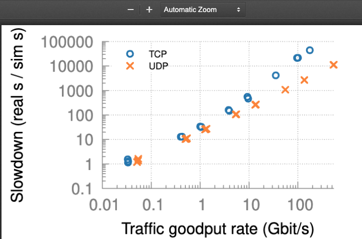
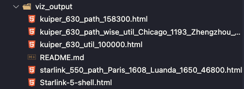
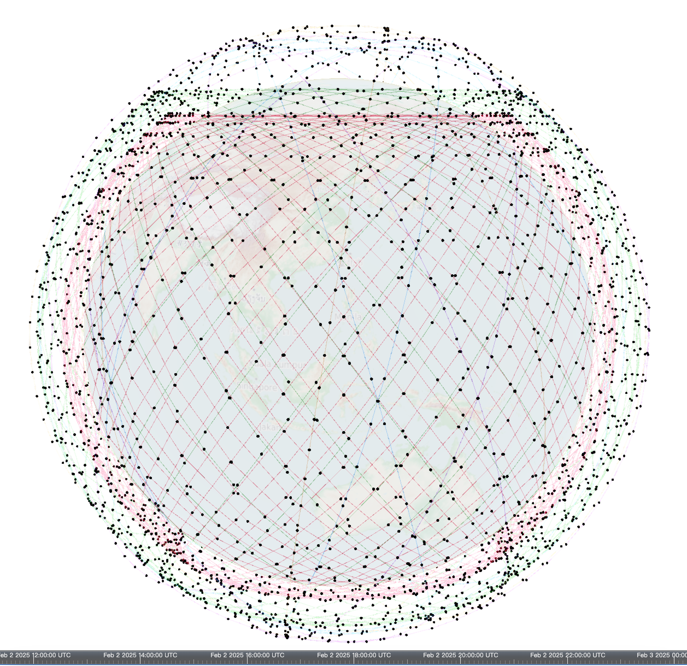
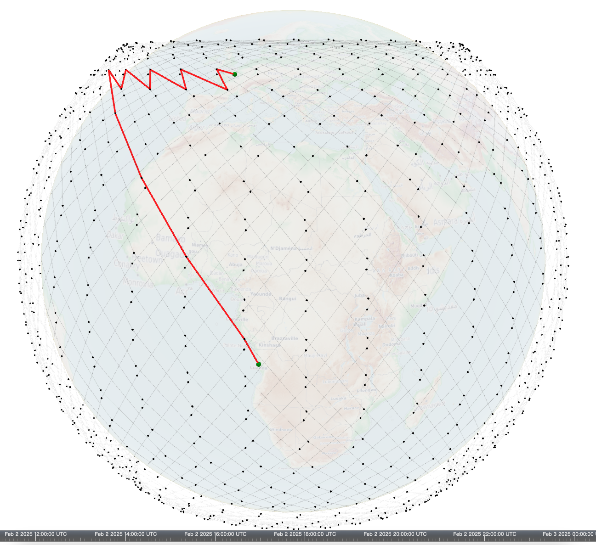
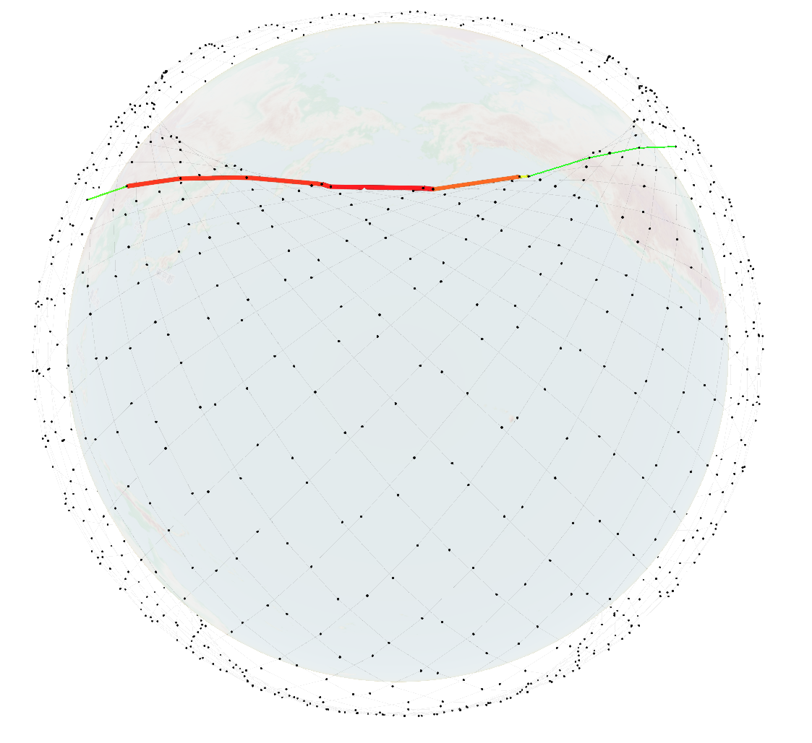
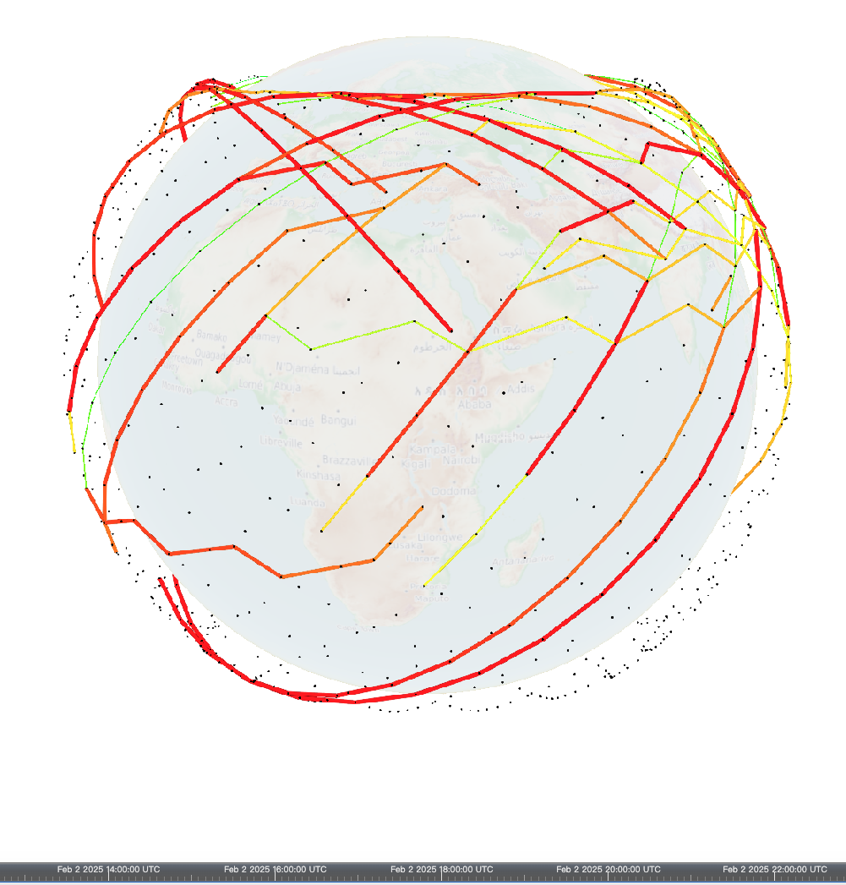
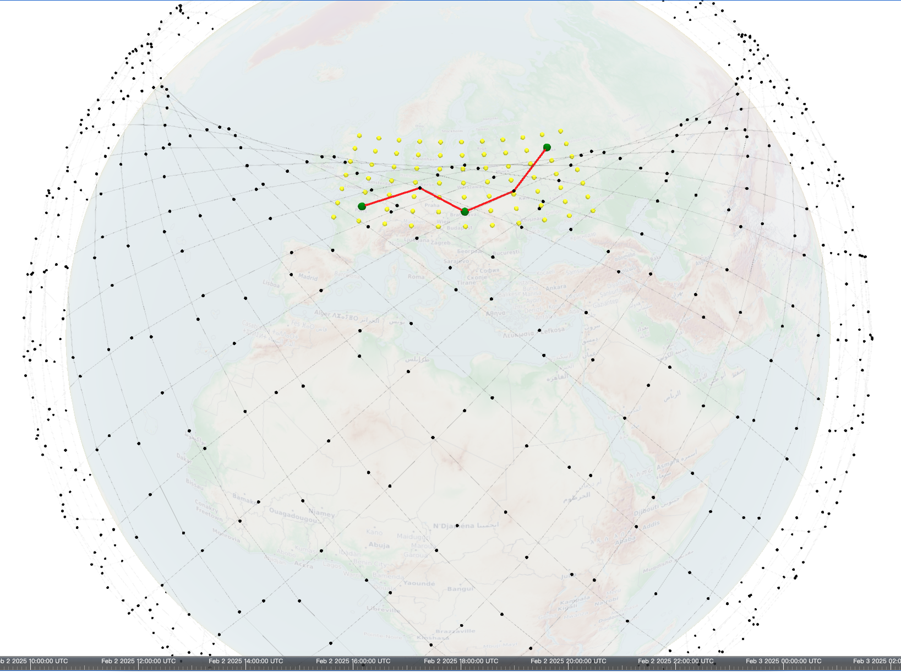
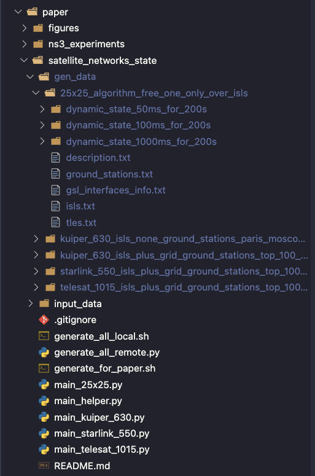
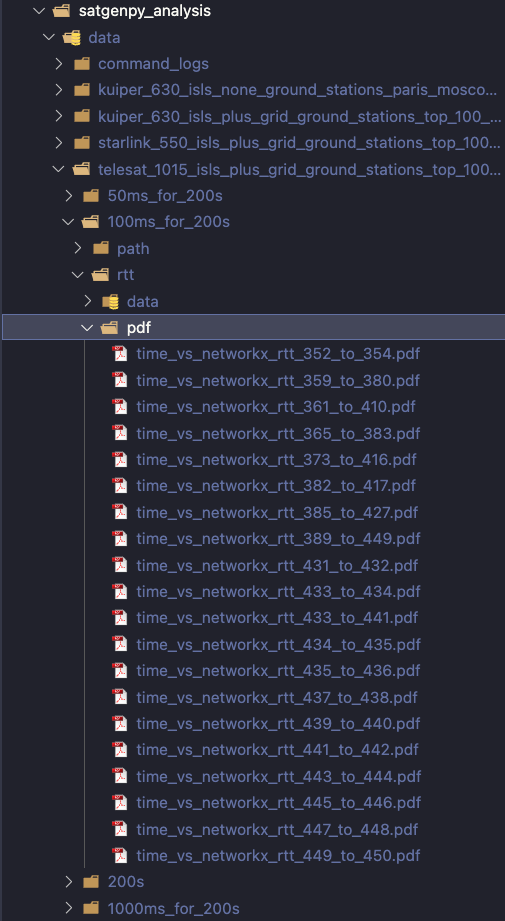

# Hypatia Implementation

这是笔者围绕`hypatia`模拟器展开实验的仓库，包含原论文全部实验复现、新特性引入👀

- 论文: [IMC 20' Exploring the "Internet from space" with Hypatia](https://dl.acm.org/doi/10.1145/3419394.3423635)
- 原仓库: [snkas hypatia](https://github.com/snkas/hypatia)
- 原仓库README: [ori README](./ori-readme.md)

这个仓库更多是实验相关，笔者另写了一些针对`hypatia`模拟器的使用教程、自总结笔记（不一定对）和LEO开发的心路历程，[传送门](https://blog.bxhu2004.com/Sci_doc/hypatia/)

这个仓库是原始版+超长流水账，如果想清晰地了解每个模块，建议走上述 *传送门* 🚀

## 环境配置

跟原论文仓库不一样的是，这里给出的是我自己的运行配置

1. System setup:
    - Local Machine: MacOS Sequita 15.0.1（32G内存）
    - VM: Orbstack Ubuntu20.04 LTS (所有实验复现基于此Linux环境展开)
    - Python 3.8.10 (已开启虚拟环境,因为后续要用pip)

2. Install dependencies:
    ```
    bash hypatia_install_dependencies.sh
    ```
   
3. Build all four modules (as far as possible):
    ```
    bash hypatia_build.sh
    ```

## 实验复现

进入`paper/README.md`你会发现它存在两种路径，一种是基于作者压缩包给出的数据（自己跑太慢了），另一种是按照步骤自己本机运行

笔者一开始采用的是“按照步骤自己本机运行”，但是太太太太太慢了！

具体来说：

`Step 1: generating LEO satellite network dynamic state over time` 在我的本机上运行了超过72h，还只完成了第一阶段...

`Step 4: running ns-3 experiments` 在我的本机上运行了超过5天

由于自行跑的时间太长，遂放弃，决定利用作者给出的数据包过一遍流程

在“按照步骤自己本机运行”的过程中，笔者发现存在一些nits需要修复，这个仓库给出的是已经fix的版本

在fix的过程中，参考了以下材料与加强实现:

1. [Hypatia Issues](https://github.com/snkas/hypatia/issues)
2. [UCL LEO Course Project](https://github.com/charliebarber/hypatia)
3. [Dynamic Load-balancing Routing Algorithm for LEO](https://github.com/silent-rookie/Dynamic_Load_Balancing_Routing_Algorithm)

### 1) 基于压缩包数据的实验复现

#### 原论文数据绘图

进入 `paper/README.md`，按照给出的步骤

1. Download `hypatia_paper_temp_data.tar.gz` and put it into `<hypatia>/paper/`.
    The data is hosted on GitHub in the releases section: 
    * (v1: preliminary) https://github.com/snkas/hypatia/releases
    
      SHA-256 checksum:
      18d761a28706723b57772e0636fbc40b7d57161f4c54069eede0c8ae740cbe2d
      
    * (Previous versions: v0)
2. Double-check: the archive `<hypatia>/paper/hypatia_paper_temp_data.tar.gz` now exists.
3. Make sure you have the `numpy`, `exputil` and `networkload` Python packages installed:
    ```
    pip install numpy
    pip install git+https://github.com/snkas/exputilpy.git@v1.6
    pip install git+https://github.com/snkas/networkload.git@v1.3
    ```
4. Make sure gnuplot is installed:
    ```
    sudo apt-get install gnuplot
    ```
5. Extract the temporary data:
    ```
    cd paper
    python extract_temp_data.py
    ```

此时你会发现很多文件夹下面出现了PDF文件，比如 `paper/ns3_experiments/traffic_matrix_load/pdf/plot_goodput_rate_vs_slowdown.pdf`：

</a>

现在我们已经完成了论文中所有“不需要卫星可视化”的数据图像！

它们与论文Figure对应关系在 `paper/figures/README.md` ，汇总如下:

* Fig. 2: `traffic_matrix_load_scalability/pdf/plot_goodput_rate_vs_slowdown.pdf`
* Fig. 3(a): `a_b/multiple_rtt_matching/pdf/time_vs_multiple_rtt_pair_a.pdf`
* Fig. 3(b): `a_b/multiple_rtt_matching/pdf/time_vs_multiple_rtt_pair_b.pdf`
* Fig. 3(c): `a_b/multiple_rtt_matching/pdf/time_vs_multiple_rtt_pair_c.pdf`
* Fig. 4(a): `a_b/tcp_cwnd/pdf/time_vs_cwnd_and_bdp_plus_queue_pair_a.pdf`
* Fig. 4(b): `a_b/tcp_cwnd/pdf/time_vs_cwnd_and_bdp_plus_queue_pair_b.pdf`
* Fig. 4(c): `a_b/tcp_cwnd/pdf/time_vs_cwnd_and_bdp_plus_queue_pair_c.pdf`
* Fig. 5(a): `a_b/tcp_mayhem/pdf/time_vs_multiple_rtt_mayhem.pdf`
* Fig. 5(b): `a_b/tcp_mayhem/pdf/time_vs_tcp_cwnd_and_bdp_mayhem.pdf`
* Fig. 5(c): `a_b/tcp_mayhem/pdf/time_vs_tcp_rate_mayhem.pdf`
* Fig. 6: `constellation_comparison/general_ecdfs/pdf/ecdf_max_rtt_to_geodesic_slowdown.pdf`
* Fig. 7(a): `constellation_comparison/general_ecdfs/pdf/ecdf_max_rtt.pdf`
* Fig. 7(b): `constellation_comparison/general_ecdfs/pdf/ecdf_max_minus_min_rtt.pdf`
* Fig. 7(c): `constellation_comparison/general_ecdfs/pdf/ecdf_max_rtt_to_min_rtt_slowdown.pdf`
* Fig. 8(a): `constellation_comparison/general_ecdfs/pdf/ecdf_num_path_changes.pdf`
* Fig. 8(b): `constellation_comparison/general_ecdfs/pdf/ecdf_max_minus_min_hop_count.pdf`
* Fig. 8(c): `constellation_comparison/general_ecdfs/pdf/ecdf_max_hop_count_to_min_hop_count.pdf`
* Fig. 9(a): `constellation_comparison/general_ecdfs/pdf/ecdf_time_step_path_changes.pdf`
* Fig. 9(b): `constellation_comparison/general_ecdfs/pdf/histogram_missed_path_changes.pdf`
* Fig. 10: `traffic_matrix_unused_bandwidth/pdf/plot_specific_tm_time_vs_available_bandwidth_over_path.pdf`
* Fig. 18(a): `a_b/tcp_isls_vs_gs_relays/pdf/isls_vs_gs_relays_time_vs_isls_rtt.pdf`
* Fig. 18(b): `a_b/tcp_isls_vs_gs_relays/pdf/isls_vs_gs_relays_time_vs_gs_relays_rtt.pdf`
* Fig. 18(c): `a_b/tcp_isls_vs_gs_relays/pdf/isls_vs_gs_relays_time_vs_computed_rtt.pdf`
* Fig. 19(a): `a_b/tcp_isls_vs_gs_relays/pdf/isls_vs_gs_relays_time_vs_isls_tcp_cwnd_and_bdp_plus_queue.pdf`
* Fig. 19(b): `a_b/tcp_isls_vs_gs_relays/pdf/isls_vs_gs_relays_time_vs_gs_relays_tcp_cwnd_and_bdp_plus_queue.pdf`
* Fig. 19(c): `a_b/tcp_isls_vs_gs_relays/pdf/isls_vs_gs_relays_time_vs_tcp_rate.pdf`

#### 星链可视化

Figure11 - Figure17 是卫星模拟的可视化图像，上面没有做，需要另在`$HYPATIA/satviz`中完成:

查看`satviz/README.md`，跟着这个README做就可以了。

需要特别注意的是， __原仓库的这些步骤里有历史遗留问题__ ，笔者在这个仓库里已全部修改并确保本机可以运行！

修改一:

将`satviz/static_html/top.html` 按照我的仓库内容进行修改，在Line10换成自己的Token即可

(经测试，当前版本可以使用，20250202)

修改二:

```sh
visualize_constellation.py
```

倒数第二行，存在typo，需要修改成: `viz_string = generate_satellite_trajectories()`

使用方式：

```py
# STARLINK
NAME = "Starlink-5-shell"
SHELL_CNTR = 5
# ......

# ------------------------
# TELESAT
NAME = "Telesat"
SHELL_CNTR = 2
# ......

# ------------------------
# KUIPER
NAME = "kuiper"
SHELL_CNTR = 3
# ......
```

对于这三类卫星，每次解注释一类 并 运行 `python visualize_constellation.py` 即可！

此时我们可以在 `satviz/viz_output` 下得到相应的html文件，用 __Google浏览器 (!!!)__ 打开这些html文件，稍等加载几秒钟即可

（经实验，在当前的Cesium版本(1.57)下，用Safari浏览器打开会有未知问题导致星链无法显示）

剩余步骤按照 `satviz/README.md` 即可，此时我们会得到：

<a href="#"></a>

如果在Google浏览器打开，会得到这些图像:

<a href="#"></a>
<a href="#"></a>

<a href="#"></a>
<a href="#"></a>

<a href="#"></a>

### 2) 按步骤本机实验复现

时间太长，TBD

## 模拟器实现逻辑

大纲体现于`paper/README.md`:

- Step 1: generating LEO satellite network dynamic state over time: 
    - `<hypatia>/paper/satellite_networks_state/README.md`
- Step 2: build ns-3 simulator
    - `<hypatia>/ns3-sat-sim/README.md`
- Step 3: performing analysis using satgenpy
    - `<hypatia>/paper/satgenpy_analysis/README.md`
- Step 4: running ns-3 experiments
    - `<hypatia>/paper/ns3_experiments/README.md`
- Step 5: generating satviz figures
    - `<hypatia>/satviz/README.md` under `Visualizations in the paper`.
- Step 6: plotting figures of the paper
    - `<hypatia>/paper/figures/README.md`

### Step 1

这个模块利用 `satgenpy` 生成LEO卫星的状态数据，它可以生成csv/txt等格式

PS: 我的机器本地跑大概要1~2天才能结束

__运行逻辑__:

`bash generate_all_local.sh` -> `generate_for_paper.sh` -> `main_xxx.py` 按序执行

__生成数据__ (`paper/satellite_networks_state/gen_data`):

<a href="#"></a>

### Step 2

这里引入了两个外部模块来辅助卫星模拟器建模，实现包粒度的LEO网络模拟

PS: 在step2中，我们目前只管先构建，不管运行原理 (Step4会设计到)

1. `simulator/src/satellite`:
    - [原ns-3-satellite仓库](https://gitlab.inesctec.pt/pmms/ns3-satellite)，使用方式是将其放入`src`下并rebuild即可
    - 用处是: 计算通过GSL和ISL链路的包的延迟
    - ns-3版本: 3.31（此时还是用waf作为构建工具的）
2. `simulator/contrib/basic-sim`:
    - [原子模块仓库](https://github.com/snkas/basic-sim/tree/3b32597c183e1039be7f0bede17d36d354696776)
    - 用处是: 模拟器框架
    - ns-3版本: 3.33

__运行逻辑__:

`bash build.sh --optimized` -> 构建`./waf configure --build-profile=optimized --enable-mpi --out=build/optimized || exit 1` && 运行`./waf -j4 || exit 1` 

现在所有模块都已经构建好了，按照论文复现的步骤，Step2 已 over！

但是！我们还需要参考`ns3-sat-sim/simulator/contrib/basic-sim/doc`下的教程进行系统学习！

这一部分非常非常重要，后期自定义模块都在这里！

笔者对这一部分的汇总解析在这里, [传送门](./basic-sim-notes.md)

### Step 3

将生成的所有关于LEO的数据进行分析，包含：

- 星座覆盖范围
- 卫星间距离变化
- 链路可用性
- 网络连通性
- 地面站覆盖情况

论文里部分性能分析应该来自于这里

__数据来源__:

`paper/satellite_networks_state/gen_data/`，这些数据txt/csv在Step1中生成

__运行顺序__:

`python perform_full_analysis.py` 是分析脚本

__生成数据__ (`paper/satgenpy_analysis/data`):

<a href="#"></a>

### Step 4

LEO卫星网络模拟器的具体使用！

#### A to B experiments

__数据来源__:

来自 Step 1 使用`satgenpy`提供的星座动态状态数据

__运行顺序__

```bash
cd a_b || exit 1
python step_1_generate_runs.py || exit 1
python step_2_run.py || exit 1
python step_3_generate_plots.py || exit 1
```

你会在 `a_b/` 下看见以下几个脚本:

1) `run_list.py`: 

提供很多配置运行的参数，比如`queue_size_pkt` / `pingmesh_interval_ns`

仔细回想Step 2的basic-sim中，配置文件是`config_xxx`，这些应该可以关联起来，因此合理推测这些py脚本的本质是：

1. 先给basic-sim提供指定参数
2. 基于basic-sim内核运行程序（“本质程序是basic-sim中的main函数”）
3. 将结果送回到当前

2) `step_1_generate_runs.py`:

参数配置，为run做准备

3) `step_2_run.py`:

真相大白了！确实就是上面分析的那样！

本质上，生成所有数据的源脚本是`ns3-sat-sim/simulator/scratch/main_satnet/main_satnet.cc`

我们可以从这里的python脚本分析出运行模式:

```py
for run in get_tcp_run_list():
    logs_ns3_dir = "runs/" + run["name"] + "/logs_ns3"
    local_shell.remove_force_recursive(logs_ns3_dir)
    local_shell.make_full_dir(logs_ns3_dir)
    commands_to_run.append(
        "cd ../../../ns3-sat-sim/simulator; "
        "./waf --run=\"main_satnet --run_dir='../../paper/ns3_experiments/a_b/runs/" + run["name"] + "'\" "
        "2>&1 | tee '../../paper/ns3_experiments/a_b/" + logs_ns3_dir + "/console.txt'"
    )
```

1. 实际运行的脚本是`main_satnet.cc`，此试验的参数来源是`a_b/runs/...`
2. 去到basic-sim，使用`./waf`构建
3. 所有的结果拷贝到当下

4) `step_3_generate_plots.py`

画图和生成PDF的脚本，不用看了

#### Traffic matrix

```bash
cd traffic_matrix || exit 1
python step_1_generate_runs.py || exit 1
python step_2_run.py || exit 1
python step_3_generate_plots.py || exit 1
```

同上，运行模式完全一致

#### Traffic matrix load (scalability)

```bash
cd traffic_matrix_load || exit 1
python step_1_generate_runs.py || exit 1
python step_2_run.py || exit 1
python step_3_generate_plots.py || exit 1
```

同上，运行模式完全一致

### Step 5

这一部分是星链的可视化，在 `satviz` 跟着README做就可以了

这一部分对应于原论文 Fig 11 - Fig 17，所有原仓库的错误在这里都已经修复完毕了

网页一旦生成好，直接跟原论文图像对比即可

对应关系是：

|Figure|Script|
|:---:|:---:|
|11|visualize_constellation.py|
|12|visualize_horizon_over_time.py|
|13|visualize_path.py|
|14|visualize_path_wise_utilization.py|
|15|visualize_utilization.py|
|16(b) & 17(b)|visualize_path_no_isl.py|

### Step 6

绘图脚本罢了，过一下流程：

__数据来源__ (`paper/figures/*`):

```sh
"constellation_comparison/general_ecdfs",
"traffic_matrix_unused_bandwidth",
"traffic_matrix_load_scalability",
"two_compete",
"a_b/multiple_rtt_matching",
"a_b/tcp_cwnd",
"a_b/tcp_rate",
"a_b/tcp_mayhem",
"a_b/tcp_isls_vs_gs_relays"
```

每个文本里面都有“画的来源是谁”：

比如，`paper/figures/constellation_comparison/general_ecdfs/plot_ecdf_max_minus_min_rtt.plt`:

```
### PLOTS
set datafile separator ","
plot    "../../../satgenpy_analysis/data/telesat_1015_isls_plus_grid_ground_stations_top_100_algorithm_free_one_only_over_isls/100ms_for_200s/rtt/data/ecdf_pairs_max_minus_min_rtt_ns.txt" using ($1/1000000):($2) title "Telesat T1" with steps ls 3, \
"../../../satgenpy_analysis/data/kuiper_630_isls_plus_grid_ground_stations_top_100_algorithm_free_one_only_over_isls/100ms_for_200s/rtt/data/ecdf_pairs_max_minus_min_rtt_ns.txt" using ($1/1000000):($2) title "Kuiper K1" with steps ls 1, \
"../../../satgenpy_analysis/data/starlink_550_isls_plus_grid_ground_stations_top_100_algorithm_free_one_only_over_isls/100ms_for_200s/rtt/data/ecdf_pairs_max_minus_min_rtt_ns.txt" using ($1/1000000):($2) title "Starlink S1" with steps ls 2, \
```

来源是 `../../../satgenpy_analysis/data/xxx` (Step3生成的)

（当然你也可以换别的“来源”，在plot脚本更改即可）

__运行顺序__:

`python plot_all.py` -> 里面的`local_shell.copy_file`可以实现“画图来源自定义” -> gnuplot画图处理

__生成数据__:

在 `figures/xxx/`下的pdf，它们与原论文图片的对应关系:

* Fig. 2: `traffic_matrix_load_scalability/pdf/plot_goodput_rate_vs_slowdown.pdf`
* Fig. 3(a): `a_b/multiple_rtt_matching/pdf/time_vs_multiple_rtt_pair_a.pdf`
* Fig. 3(b): `a_b/multiple_rtt_matching/pdf/time_vs_multiple_rtt_pair_b.pdf`
* Fig. 3(c): `a_b/multiple_rtt_matching/pdf/time_vs_multiple_rtt_pair_c.pdf`
* Fig. 4(a): `a_b/tcp_cwnd/pdf/time_vs_cwnd_and_bdp_plus_queue_pair_a.pdf`
* Fig. 4(b): `a_b/tcp_cwnd/pdf/time_vs_cwnd_and_bdp_plus_queue_pair_b.pdf`
* Fig. 4(c): `a_b/tcp_cwnd/pdf/time_vs_cwnd_and_bdp_plus_queue_pair_c.pdf`
* Fig. 5(a): `a_b/tcp_mayhem/pdf/time_vs_multiple_rtt_mayhem.pdf`
* Fig. 5(b): `a_b/tcp_mayhem/pdf/time_vs_tcp_cwnd_and_bdp_mayhem.pdf`
* Fig. 5(c): `a_b/tcp_mayhem/pdf/time_vs_tcp_rate_mayhem.pdf`
* Fig. 6: `constellation_comparison/general_ecdfs/pdf/ecdf_max_rtt_to_geodesic_slowdown.pdf`
* Fig. 7(a): `constellation_comparison/general_ecdfs/pdf/ecdf_max_rtt.pdf`
* Fig. 7(b): `constellation_comparison/general_ecdfs/pdf/ecdf_max_minus_min_rtt.pdf`
* Fig. 7(c): `constellation_comparison/general_ecdfs/pdf/ecdf_max_rtt_to_min_rtt_slowdown.pdf`
* Fig. 8(a): `constellation_comparison/general_ecdfs/pdf/ecdf_num_path_changes.pdf`
* Fig. 8(b): `constellation_comparison/general_ecdfs/pdf/ecdf_max_minus_min_hop_count.pdf`
* Fig. 8(c): `constellation_comparison/general_ecdfs/pdf/ecdf_max_hop_count_to_min_hop_count.pdf`
* Fig. 9(a): `constellation_comparison/general_ecdfs/pdf/ecdf_time_step_path_changes.pdf`
* Fig. 9(b): `constellation_comparison/general_ecdfs/pdf/histogram_missed_path_changes.pdf`
* Fig. 10: `traffic_matrix_unused_bandwidth/pdf/plot_specific_tm_time_vs_available_bandwidth_over_path.pdf`
* Fig. 18(a): `a_b/tcp_isls_vs_gs_relays/pdf/isls_vs_gs_relays_time_vs_isls_rtt.pdf`
* Fig. 18(b): `a_b/tcp_isls_vs_gs_relays/pdf/isls_vs_gs_relays_time_vs_gs_relays_rtt.pdf`
* Fig. 18(c): `a_b/tcp_isls_vs_gs_relays/pdf/isls_vs_gs_relays_time_vs_computed_rtt.pdf`
* Fig. 19(a): `a_b/tcp_isls_vs_gs_relays/pdf/isls_vs_gs_relays_time_vs_isls_tcp_cwnd_and_bdp_plus_queue.pdf`
* Fig. 19(b): `a_b/tcp_isls_vs_gs_relays/pdf/isls_vs_gs_relays_time_vs_gs_relays_tcp_cwnd_and_bdp_plus_queue.pdf`
* Fig. 19(c): `a_b/tcp_isls_vs_gs_relays/pdf/isls_vs_gs_relays_time_vs_tcp_rate.pdf`

